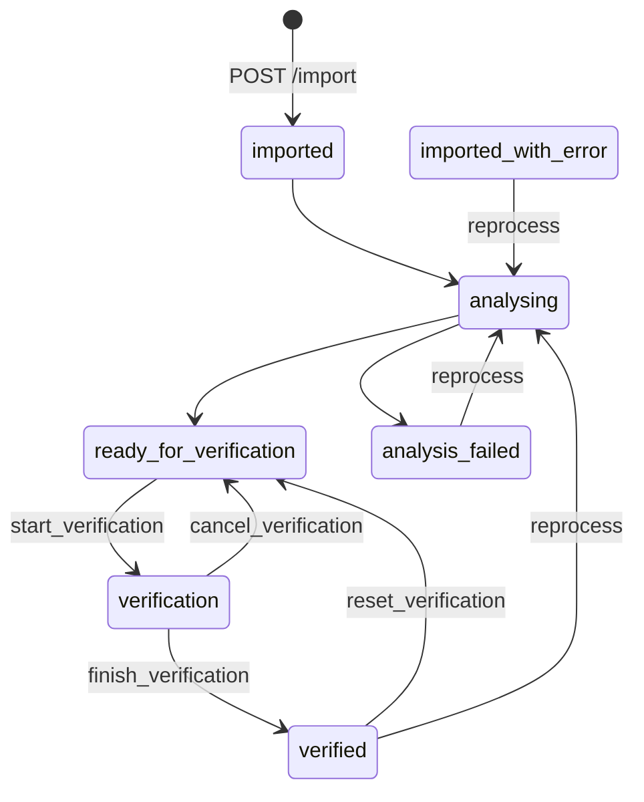

# IDP API Contract (extracted from openapi.json)

Source: `idp-next-prototype/streamlit/openapi.json` — OpenAPI 3.1.0
Service: `IDP Package Manager` v1.0.0 (FastAPI, DDD/CQRS)

## Auth

All non-`/health` endpoints expect header `X-Auth-Request-Email: <email>` (set upstream by oauth2-proxy). OpenAPI does **not** declare a `securitySchemes` block — auth is implicit at the ingress layer, not a FastAPI dependency. Frontend/MSW must inject this header for every request.

`GET /user/me` returns `{ email, has_access }` — use for gating UI.

## Endpoint Catalog

| Method | Path                                                                   | Purpose                                                        | Key params                                                                                                                                                                                    | Response                                         | Errors                                    |
| ------ | ---------------------------------------------------------------------- | -------------------------------------------------------------- | --------------------------------------------------------------------------------------------------------------------------------------------------------------------------------------------- | ------------------------------------------------ | ----------------------------------------- |
| GET    | `/health`                                                              | Liveness                                                       | —                                                                                                                                                                                             | `{[k]: string}`                                  | —                                         |
| GET    | `/user/me`                                                             | Current user (from proxy header)                               | —                                                                                                                                                                                             | `UserInfoResponse`                               | —                                         |
| GET    | `/packages/get_all`                                                    | List packages (paginated, filterable)                          | `limit` 1-100 (d=10), `offset` (d=0), `status?`, `search?`, `sort_by` ∈ `created_date\|file_name\|status` (d=`created_date`), `sort_order` ∈ `asc\|desc` (d=`desc`), `date_from?`, `date_to?` | `PaginatedPackageResponse`                       | 422                                       |
| GET    | `/packages/action_logs`                                                | Global action log, paginated                                   | `limit`, `offset`, `action_type?`, `performed_by?`, `date_from?`, `date_to?`, `sort_order`                                                                                                    | `PaginatedActionLogResponse`                     | 422                                       |
| GET    | `/packages/dashboard-stats`                                            | Status counters for dashboard                                  | —                                                                                                                                                                                             | `DashboardStatsResponse`                         | —                                         |
| POST   | `/packages/import`                                                     | Upload a single package                                        | multipart `file`                                                                                                                                                                              | `{}` (empty 200)                                 | 400 `ErrorResponse`, 422                  |
| POST   | `/packages/import-multiple`                                            | Upload batch                                                   | multipart `files[]`                                                                                                                                                                           | `{}`                                             | 400, 422                                  |
| GET    | `/packages/{package_id}/download`                                      | Download original file                                         | path                                                                                                                                                                                          | binary (`application/json` schema empty in spec) | 404, 422                                  |
| GET    | `/packages/{package_id}/download-result`                               | Download analysis/verified result                              | path                                                                                                                                                                                          | binary                                           | 400, 422                                  |
| GET    | `/packages/{package_id}/export-csv`                                    | CSV export of result                                           | path                                                                                                                                                                                          | binary                                           | 400 (`CSV_EXPORT_VALIDATION_FAILED`), 422 |
| GET    | `/packages/{package_id}/export-xml`                                    | XML export of result                                           | path                                                                                                                                                                                          | binary                                           | 400, 422                                  |
| GET    | `/packages/{package_id}`                                               | Package details incl. analysis/verified payloads, tokens, cost | path                                                                                                                                                                                          | `PackageDetailsResponse`                         | 404, 422                                  |
| GET    | `/packages/{package_id}/actions`                                       | Per-package action history                                     | path                                                                                                                                                                                          | `PackageActionsResponse`                         | 404, 422                                  |
| GET    | `/packages/{package_id}/transport-orders`                              | Transport orders (analysed + verified)                         | path                                                                                                                                                                                          | `PackageTransportOrdersResponse`                 | 404, 422                                  |
| GET    | `/packages/{package_id}/transitions`                                   | Allowed state transitions right now                            | path                                                                                                                                                                                          | `PackageTransitionsResponse`                     | 404, 422                                  |
| POST   | `/packages/{package_id}/start-verification`                            | Transition: begin verification                                 | path                                                                                                                                                                                          | `{}`                                             | 400, 404, 422                             |
| POST   | `/packages/{package_id}/cancel-verification`                           | Transition: cancel verification                                | path                                                                                                                                                                                          | `{}`                                             | 400, 404, 422                             |
| POST   | `/packages/{package_id}/finish-verification`                           | Transition: mark verified                                      | path                                                                                                                                                                                          | `{}`                                             | 400, 404, 422                             |
| POST   | `/packages/{package_id}/reset-verification`                            | Transition: reset to ready                                     | path                                                                                                                                                                                          | `{}`                                             | 400, 404, 422                             |
| POST   | `/packages/{package_id}/reprocess`                                     | Re-run analysis                                                | path                                                                                                                                                                                          | `{}`                                             | 400, 404, 422                             |
| POST   | `/packages/{pid}/transport-orders/{oid}/seller`                        | Patch seller party                                             | body `UpdatePartyRequest`                                                                                                                                                                     | `{}`                                             | 400, 404, 422                             |
| POST   | `/packages/{pid}/transport-orders/{oid}/buyer`                         | Patch buyer party                                              | body `UpdatePartyRequest`                                                                                                                                                                     | `{}`                                             | 400, 404, 422                             |
| POST   | `/packages/{pid}/transport-orders/{oid}/consignor`                     | Patch consignor party                                          | body `UpdatePartyRequest`                                                                                                                                                                     | `{}`                                             | 400, 404, 422                             |
| POST   | `/packages/{pid}/transport-orders/{oid}/consignee`                     | Patch consignee party                                          | body `UpdatePartyRequest`                                                                                                                                                                     | `{}`                                             | 400, 404, 422                             |
| POST   | `/packages/{pid}/transport-orders/{oid}/transport-info`                | Patch transport info (truck, mode, countries)                  | body `UpdateTransportInfoRequest`                                                                                                                                                             | `{}`                                             | 400, 404, 422                             |
| POST   | `/packages/{pid}/transport-orders/{oid}/invoices/{iid}`                | Patch invoice header                                           | body `UpdateInvoiceRequest`                                                                                                                                                                   | `{}`                                             | 400, 404, 422                             |
| POST   | `/packages/{pid}/transport-orders/{oid}/invoices/{iid}/lines`          | Replace invoice line updates (by `line_id`)                    | body `UpdateInvoiceLinesRequest`                                                                                                                                                              | `{}`                                             | 400, 404, 422                             |
| POST   | `/packages/{pid}/transport-orders/{oid}/invoices/{iid}/totals`         | Patch invoice totals                                           | body `UpdateInvoiceTotalsRequest`                                                                                                                                                             | `{}`                                             | 400, 404, 422                             |
| POST   | `/packages/{pid}/transport-orders/{oid}/invoices/{iid}/delivery-terms` | Patch Incoterms / delivery area                                | body `UpdateDeliveryTermsRequest`                                                                                                                                                             | `{}`                                             | 400, 404, 422                             |

**Total: 28 endpoints** across tags `packages`, `transport-orders`, `user`, (untagged `/health`).

## Enums

| Name                | Values                                                                                                                                                                                                                                                                                                                                                                     | Meaning                                                                                           |
| ------------------- | -------------------------------------------------------------------------------------------------------------------------------------------------------------------------------------------------------------------------------------------------------------------------------------------------------------------------------------------------------------------------- | ------------------------------------------------------------------------------------------------- |
| `PackageStatus`     | `imported`, `imported_with_error`, `analysing`, `analysis_failed`, `ready_for_verification`, `verification`, `verified`                                                                                                                                                                                                                                                    | Lifecycle state of a package. Terminal-ish: `verified`, `imported_with_error`, `analysis_failed`. |
| `PackageTransition` | `start_verification`, `cancel_verification`, `finish_verification`, `reset_verification`, `reprocess`                                                                                                                                                                                                                                                                      | Commands allowed against a package; drives the state machine.                                     |
| `PackageActionType` | `imported`, `imported_with_error`, `analysing`, `analysis_failed`, `ready_for_verification`, `verification`, `cancel_verification`, `verified`, `reset_verification`, `seller_updated`, `buyer_updated`, `consignor_updated`, `consignee_updated`, `invoice_updated`, `invoice_line_updated`, `invoice_totals_updated`, `delivery_terms_updated`, `transport_info_updated` | Event types written to the action log (superset of statuses + edit events).                       |
| `ErrorCode`         | `PACKAGE_DUPLICATE`, `PACKAGE_NOT_FOUND`, `FILE_NOT_FOUND`, `INVALID_PACKAGE_FILE`, `TRANSITION_NOT_ALLOWED`, `RESULT_NOT_FOUND`, `ENTITY_NOT_FOUND`, `CSV_EXPORT_VALIDATION_FAILED`                                                                                                                                                                                       | Stable error identifiers, each with documented `variables` dict for i18n.                         |

**Total: 4 enums.**

## Package State Machine

Derived from transition names + status set. Not explicitly encoded in openapi — inferred.



Use `GET /packages/{id}/transitions` to know which buttons to render — do not hardcode the table above on the client; it's a _hint_, server is authoritative.

## Pagination

Offset-based. Every list endpoint accepts `limit` (1-100, default 10) and `offset` (>=0, default 0). Responses wrap items in `{ items, total, limit, offset }` (`PaginatedPackageResponse`, `PaginatedActionLogResponse` — identical shape, different item type). No cursor pagination, no `next_url`. Frontend must compute page count from `total / limit`.

## Sort

Only `/packages/get_all` supports field sorting: `sort_by` (`created_date` | `file_name` | `status`) plus `sort_order` (`asc` | `desc`). `/packages/action_logs` exposes only `sort_order` (implicit sort by timestamp). Sort values are enforced server-side via regex patterns.

## Filter

- Packages: `status` (free string, not enum-enforced in query — server likely coerces), `search` (substring, field scope undocumented), `date_from`/`date_to` (ISO 8601 date-time, presumably on `created_date`).
- Action logs: `action_type` (free string — client should pass `PackageActionType` values), `performed_by` (email/username), `date_from`/`date_to` on `timestamp`.

All filters are optional and nullable; absence means no constraint.

## File Upload

- `POST /packages/import` — `multipart/form-data`, single field `file` (binary).
- `POST /packages/import-multiple` — `multipart/form-data`, field `files` as an array of binaries.
- **No MIME allowlist, no size limit declared** in openapi. Server returns `INVALID_PACKAGE_FILE` on rejection; expect validation failures at runtime. Frontend should impose a sane client-side size cap (suggest 25-50 MB) and display server error verbatim.

## Error Response

All 400/404 errors return `ErrorResponse`:

```json
{
  "error_code": "PACKAGE_NOT_FOUND",
  "message": "Package with id '{package_id}' not found",
  "variables": { "package_id": "abc123" }
}
```

`variables` is optional but always present in practice — use it for client-side i18n instead of parsing `message`. FastAPI validation failures return `HTTPValidationError` (422) with a different shape: `{ detail: ValidationError[] }`.

## Gaps / Quirks

1. **Auth is invisible in the spec.** No `securitySchemes`, no `X-Auth-Request-Email` parameter declared. Easy to forget when building MSW handlers. Codegen tools will not emit it.
2. **Download endpoints lie.** `/download`, `/download-result`, `/export-csv`, `/export-xml` declare `application/json` with empty schema. They actually stream binary. Use `fetch` + `blob()` not `response.json()`.
3. **Numeric fields serialised as strings.** `total_cost_usd`, all invoice money/weight/quantity fields on `UpdateInvoice*Request` and `InvoiceLineUpdateRequest` are `string` (arbitrary-precision regex). Frontend must preserve strings through the edit flow — parsing to `number` risks precision loss.
4. **`analysis_result` / `verified_result` are untyped.** `anyOf: [array, object, null]` with empty inner schemas. These carry the extraction payloads but the spec doesn't describe them. Treat as `unknown` in TS and narrow at the render site.
5. **`PackageTransportOrdersResponse.transport_orders` is also untyped** (`items: {}`). Same deal — domain shape lives elsewhere.
6. **`status` query param on `get_all` is `string`, not `PackageStatus` enum.** Server will accept junk and return empty lists silently. Client should constrain to the enum.
7. **`PackageActionType` is a superset of `PackageStatus`.** Some actions (e.g. `verification`, `reset_verification`) share names with transitions; the log mixes state-entry events with edit events. Don't treat `action_type` as "status change".
8. **All mutation endpoints return `{}`.** No updated entity echoed back — client must refetch (`GET /packages/{id}`) after every PATCH to stay in sync. Consider optimistic updates + invalidate.
9. **No DELETE endpoints.** Packages can't be removed via API. Assume soft-delete or admin-only path lives outside this surface.
10. **`POST` used for partial updates** instead of `PATCH`. Purely a convention choice; no semantic difference for clients, just note it for REST purists.
11. **`UpdateInvoiceLinesRequest` semantics unclear.** Spec says `lines: InvoiceLineUpdateRequest[]` where each line has a required `line_id` and all other fields optional. Likely "apply these partial patches to matching lines" — not a replace-all. Confirm at integration time.
12. **No rate limits, no idempotency keys** declared. Batch import endpoint has no size cap visible.
